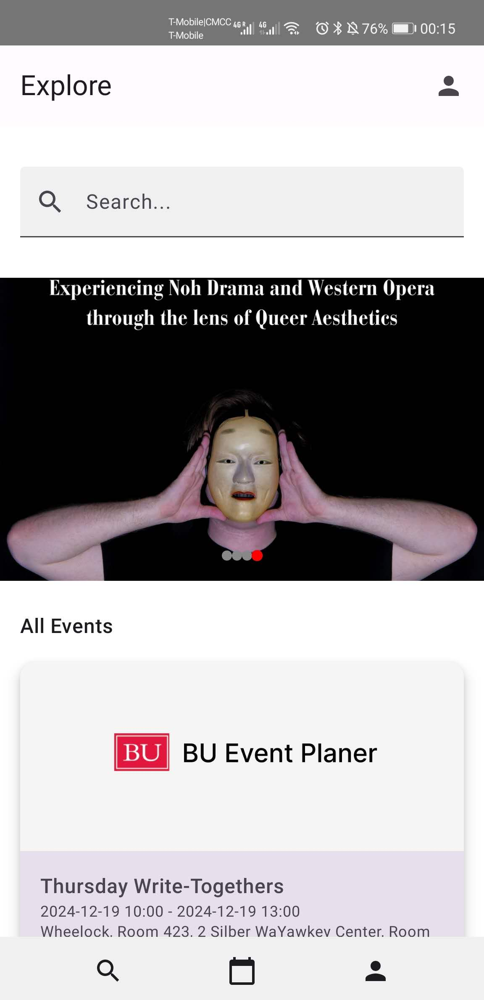
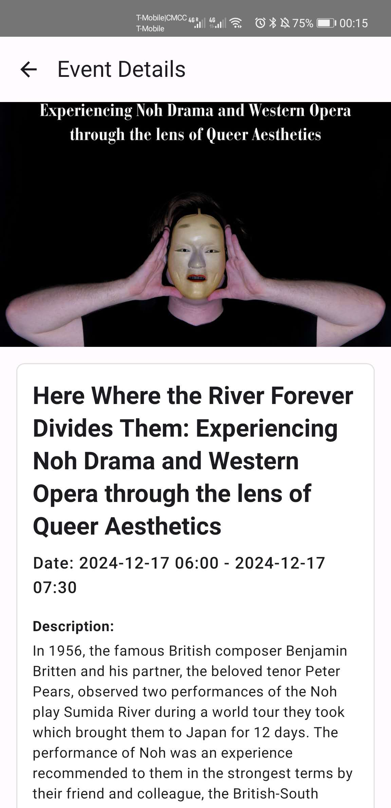
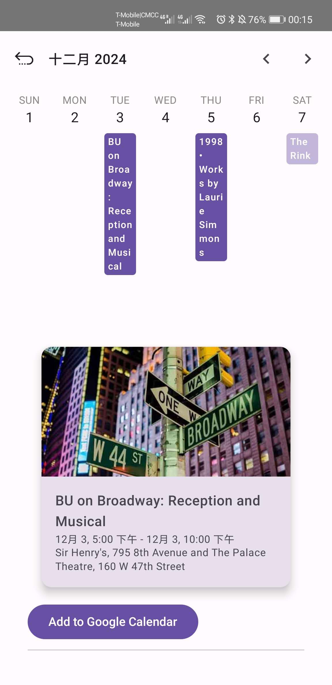

# BU Event Planner

Developer：Jialong Ke, Yuchen Cao, Zihan Li, 

The **BU Event Planner** is a user-friendly app designed to help Boston University students and community members explore and manage events seamlessly. With features like an interactive calendar, personalized event recommendations, and Google Calendar integration, it ensures users never miss out on exciting opportunities.

---

## Features

### 1. **Explore Events**
   - Browse a list of upcoming and reviewed events.
   - Search events by title, location, or description.
   - View detailed event pages with descriptions, timings, and locations.

### 2. **Interactive Calendar**
   - View events organized by date in a responsive weekly calendar.
   - Add events directly to your Google Calendar with a single click.
   - Differentiate added events with highlighted colors.

### 3. **Personalized Profile**
   - View and update your profile information (name and profile picture).
   - See a curated list of events you've added for.
   - Log in and out of your account securely.

### 4. **Google Maps Integration**
   - See event locations on an interactive map.
   - Automatically fetch and display locations from the event's address.

### 5. **Google Calendar Integration**
   - Seamlessly add events to your Google Calendar.
   - Pre-filled event details, including title, location, and time.

---

## Installation and Setup

Scan this QR code to download the app:

---

## Usage Instructions

### **Exploring Events**
1. Launch the app and navigate to the **Search** tab.
2. Use the search bar to filter events by keywords.
3. Tap an event card to view its details, including the description, timings, and location.

### **Adding Events to Calendar**
1. Tap the **Calendar** tab to view your weekly schedule.
2. Events for each date are displayed in corresponding blocks.
3. Tap an event to view details and click **Add to Google Calendar** to integrate.

### **Add or remove for Events**
1. From the event details page, tap **Add to Calendar**.
2. Added events are highlighted in your calendar.
3. Remove at any time by clicking **Remove from Calendar**.

### **Managing Your Profile**
1. Go to the **Profile** tab.
2. Edit your name or upload a new profile picture by tapping the profile area.
3. View a list of events you’ve added for in the **Upcoming** tab. for events that time passed will in the **Passed** tab.
4. Log in or out of your account using the **Sign In/Out** button.

---

## Developer Guide

### Key Technologies Used
- **Jetpack Compose**: For modern, declarative UI development.
- **Firebase**:
  - **Authentication**: Secure user login and logout.
  - **Realtime Database**: Store and fetch event data.
  - **Firestore**: For structured and scalable user data.
- **Google Maps and Geocoding API**: Display event locations dynamically.
- **Accompanist Pager**: Swipeable views for weekly calendar navigation.
- **Coil**: For efficient image loading.

---

## Screenshots
1. **Home Page**
   > Displays a curated list of events with a search bar.
   

2. **Weekly Calendar**
   > Interactive calendar with highlighted added events.
   

3. **Event Details**
   > View comprehensive event details.
   

---

This README is designed to guide users and developers in understanding the app’s functionality and development environment setup.
